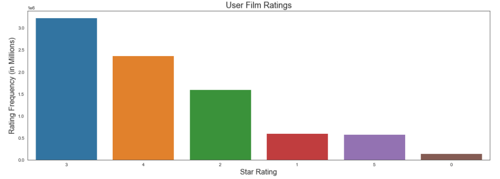

# Letterboxd Analysis Project

**Author**: Sierra Stanton

## Overview


This project shows an analysis of the top 4,000 users on Letterboxd and their contributed film ratings in order for us to create a recommendation system that predicts which films users will most enjoy.

## Problem

With all of the choices available to us across a myriad of sources, we need better help interpreting the signal from the noise. In this use case, we'll help film fans find their next favorite film by using an extensive database of films and ratings to better diagnose what they'll like and recommend films accordingly.

## Data

We're using data from an app called Letterboxd, which separates itself from the pack due to it's emphasis on community and social networking around film critique. In fact, this app was first recommended to me a few years back by a friend working at the Britism Film Institute (BFI) and who happened to have a taste similar to mine. My experience with Letterboxd made me particularly interested in the app's development and future value. They've experienced immense growth in the past few years - XY stat.

Letterboxd, which dubs itself a "social film discovery platform", has the ability to follow critics and see their evaluation of a wide variety of films. However, there has yet to be a way to get personalized recommendations based on your film preferences. This project solves exactly that and provides a way for Letterboxd users to get a record of the films they're most likely to enjoy.

Sam Learner scrapes data from Letterboxd and hosts the datasets we used on Kaggle [here](https://www.kaggle.com/samlearner/letterboxd-movie-ratings-data). Note - for our purposes, we choose not to use his included `Users` dataset.

Our two datasets are the following:
*  The Movie Data (`movie_data.csv`): this dataset gives us each film's unique ID, title, and year of release.
*  The Ratings Data (`ratings_export.csv`): this dataset shows each rating from 1-10 that Letterboxd's top 4,000 users have submitted according to the particular film. Note that on the app this is shown as 1-5, however the 1-10 split data reflects each half star by assigning it a number (4.5 becomes 9, 5 becomes 10).

Due to the lengthy size of the dataset (over 8M film review records), I recommend heading to the link above for download instructions and to get the very latest version of scraped data.

## Methods & Results

I use descriptive analysis and determined the top-performing recommendation model to show:
*  

### Rating Distributions Across Films


### Decades With the Most Film Ratings


### Activity Level of Users: Ratings


## Conclusions

* **

## Next Steps

This goes beyond our Letterboxed analysis and is worth further exploration.

* **

## For More Information

Please review my full analysis in the [presentation](presentation/Letterboxd-Analysis-Presentation.pdf) or notebooks: [exploratory](notebooks/exploratory.ipynb), [modeling phase](notebooks/modeling.ipynb).

For any additional questions, please contact **Sierra Stanton** & stanton.sierraerin@gmail.com

## Repository Structure

```
├── README.md
├── data
├── images
├── notebooks
└── presentation
```
