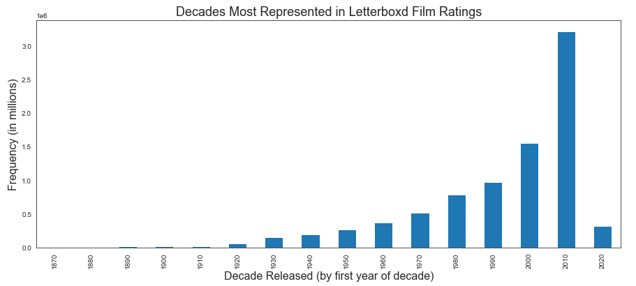
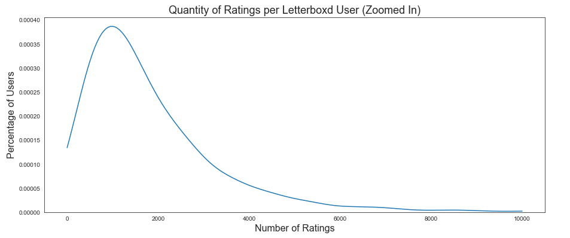

# Letterboxd Analysis Project

**Author**: Sierra Stanton

## Overview


This project shows an analysis of the top 4,000 users on Letterboxd and their contributed film ratings in order for us to create a recommendation system that predicts which films users will most enjoy.

This project could aid a company like Letterboxd in developing a recommendation engine in app or other data scientists interested in creating recommender systems via the Surprise library.

## Problem

With all of the choices available to us across a myriad of sources, we need better help interpreting the signal from the noise. In this use case, we'll help film fans find their next favorite film by using an extensive database of films and ratings to better diagnose what they'll like and recommend films accordingly.

## Data

We're using data from an app called Letterboxd, which separates itself from the pack due to it's emphasis on community and social networking around film critique. In fact, this app was first recommended to me a few years back by a friend working at the British Film Institute (BFI) and who happened to have a film taste similar to mine. My experience with Letterboxd as a user made me particularly interested in the app's development and future value. They've experienced immense growth in the past few years - learn a bit more about what makes them different [here](https://www.nytimes.com/2021/01/13/movies/letterboxd-growth.html).

One of Letterboxd's main features is the ability for users to follow others and see their evaluation of a wide variety of films. However, there has yet to be a way to get personalized recommendations based on your noted film preferences. This project solves exactly that and provides a way for Letterboxd users to get a record of the films they're most likely to enjoy.

Sam Learner regularly scrapes data from Letterboxd and hosts the datasets we used on Kaggle [here](https://www.kaggle.com/samlearner/letterboxd-movie-ratings-data). Note - for our purposes, we choose not to use his included `Users` dataset.

Our two datasets are the following:
*  The Movie Data (`movie_data.csv`): this dataset gives us over 250K film's unique ID, title, and year of release.
*  The Ratings Data (`ratings_export.csv`): this dataset shows over 8M recorded ratings from a range of 1-10 that Letterboxd's top 4,000 users have submitted according to the particular film. Note that on the app itself there is a five star scale, however the 1-10 split data reflects each half star by assigning it a number (4.5 becomes 9, 5 becomes 10).

Due to the lengthy size of our datasets (over 250K films, 8M film reviews), I recommend heading to the Sam's link above for download instructions and to get the very latest version of scraped data.

## Environment
To ensure you have all required packages if you'd like to run these notebooks, an environment.yml file has been provided [here](https://www.kaggle.com/samlearner/letterboxd-movie-ratings-data). Follow the set-up instructions [here](https://www.kaggle.com/samlearner/letterboxd-movie-ratings-data) to create and activate the environment.

## Methods & Results

I use descriptive analysis and incrementally improved recommendation engines to determine:
*  The SVD recommender model from Surprise was our best performing model to date, bringing our accuracy in determining how a user would rate a film within less than a star from reality (our RMSE was within 7/10 of a star)
*  The notable nature of Letterboxd reviews - more specifically, the breakdown and distribution of film ratings according to a five star scale - which shows us the margins are the least represented (up to 1 star, 5 stars) and the middle holds the most weight with a noticeable skew toward the higher end (3, 4, 2 in decreasing order). Coupling this data with psycographic data around the nature of film critique/ratings and which films we might watch or complete in order to give a review to begin with is worth exploring - especially when digging into the nature of recommendations and content discovery.
*  


### Rating Distributions Across Films


### Decades With the Most Film Ratings


### Activity Level of Users: Ratings


## Conclusions

* **

## Next Steps

This goes beyond our Letterboxed analysis and is worth further exploration.

* **Deploying this project to production is an immediate next step and the foundation was created in our [rating-system](notebooks/rating-system.ipynb) file
* **If we were to use particular quantile groupings of user review activity to better understand the user and determine which grouping represents a general Letterboxd user - I believe this would be valuable. I can infer some of the users in our data are actually groups of people or organizations (i.e. anomalies of 70K+ reviews recorded and attributed to one username)
* **If we were to bring in additional data, say the review text and additional categorical film data, we could create increasingly helpful clustering around user film preferences to aid in discovery. We could also bring in sentiment analysis or a prompting question at the start of the discovery/recommendation process in order to recommend content based on a person's current mood or general temperament.
* **We focused on a collaborative filtering model in this project, but could perhaps further increase our accuracy with a hybrid approach (implicit and explicit, with a library like LightFM[here](https://github.com/lyst/lightfm))

## For More Information

Please review my full analysis in the [presentation](presentation/Letterboxd-Analysis-Presentation.pdf) or notebooks: [exploratory](notebooks/exploratory.ipynb), [modeling phase](notebooks/modeling.ipynb), [rating-system](notebooks/rating-system.ipynb), [gridsearch](gridsearch.ipynb).

For any additional questions, please contact **Sierra Stanton** & stanton.sierraerin@gmail.com

## Repository Structure

```
├── README.md
├── data
├── images
├── notebooks
└── presentation
```

## Notebooks Structure

```
├── notebooks
├──── exploratory.ipynb
├──── modeling.ipynb
├──── crossvalidation.ipynb
├──── rating-system.ipynb
```
